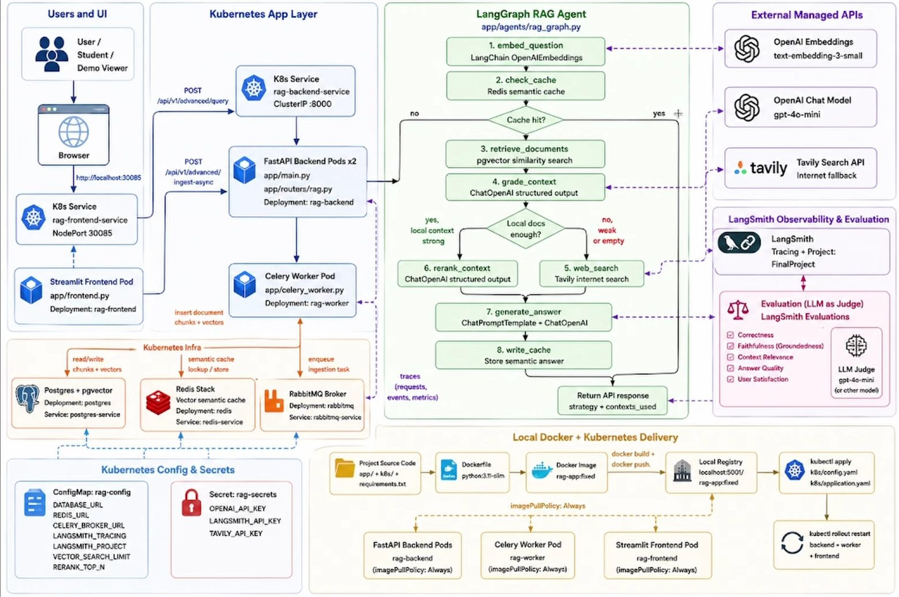

# LangGraph RAG Agent — Local Kubernetes Demo

This repo reproduces your architecture diagram exactly, running entirely on
**one Ubuntu laptop** inside a **single-node minikube cluster**. 



Every box in the diagram is a real container:

| Diagram box | Runs as |
|---|---|
| Streamlit Frontend Pod | Deployment `rag-frontend`, Service `rag-frontend-service` (NodePort 30085) |
| FastAPI Backend Pods x2 | Deployment `rag-backend`, Service `rag-backend-service` (ClusterIP :8000) |
| Celery Worker Pod | Deployment `rag-worker` |
| Postgres + pgvector | Deployment `postgres`, Service `postgres-service` |
| Redis Stack (semantic cache) | Deployment `redis`, Service `redis-service` |
| RabbitMQ Broker | Deployment `rabbitmq`, Service `rabbitmq-service` |
| ConfigMap `rag-config` / Secret `rag-secrets` | `k8s/config.yaml` (ConfigMap) + Secret created imperatively from `.env` |
| Local Registry `localhost:5001` -> `rag-app:fixed` | minikube's `registry` addon, port-forwarded to `localhost:5001` |
| LangGraph RAG Agent (`app/agents/rag_graph.py`) | runs *inside* the FastAPI backend pods, delegates to `app/services/*` |
| OpenAI Embeddings / Chat, Tavily Search | called over the internet from inside the pods (only external calls made) |
| LangSmith tracing | enabled via `LANGSMITH_*` env vars, also called over the internet |
| Evaluation (LLM as Judge) | `app/evaluation/` — Correctness, Faithfulness, Context Relevance, Answer Quality, User Satisfaction |

Only the OpenAI, Tavily and LangSmith API calls leave your laptop. Everything
else — frontend, backend, worker, Postgres+pgvector, Redis, RabbitMQ — runs
as containers on your local minikube cluster.

### Project layout

```
app/
  main.py                 FastAPI app entrypoint
  config.py                settings (env-driven)
  db.py                     raw Postgres/pgvector access
  celery_worker.py          Celery app + ingest_document task
  frontend.py                Streamlit UI
  routers/rag.py              /api/v1/advanced/{query,ingest-async}
  agents/rag_graph.py          LangGraph orchestration (thin, delegates below)
  services/                    business logic, one module per capability
    embedding_service.py
    cache_service.py             (app/cache.py re-exports this for compat)
    retrieval_service.py
    grading_service.py
    web_search_service.py
    generation_service.py
    ingestion_service.py
docs/HLD.md                 high-level design doc
app/guardrails/                input/output guardrails (rule-based, in-graph)
app/evaluation/                 LLM-as-judge evaluators + LangSmith wiring
k8s/
  namespace.yaml
  config.yaml               ConfigMap rag-config (+ commented Secret reference)
  infrastructure.yaml         Postgres, Redis Stack, RabbitMQ
  application.yaml             backend, worker, frontend Deployments + Services
  evaluation-job.yaml            one-off batch Job for offline evaluation
Dockerfile, requirements.txt, setup.sh, cleanup.sh, .env.example
```

---

## 1. What gets installed on your laptop

`setup.sh` checks for each of these first and only installs what's missing,
so it's safe to run over and over:

- **Docker Engine** — builds the app image and runs minikube's `docker` driver
- **kubectl** — talks to the cluster
- **minikube** — the single-node Kubernetes cluster itself
- **socat** (apt) — only used as a system fallback; the script normally uses
  the `alpine/socat` *container* image instead, so nothing extra usually
  needs installing here

Nothing else touches your host: Python, the app's own dependencies
(FastAPI, LangGraph, LangChain, Celery, Streamlit, etc.) only exist **inside**
the Docker image (`Dockerfile`), never on the host itself.

**Minimum laptop specs:** 4 CPUs / 8 GB RAM free for minikube (adjustable in
`setup.sh` if your machine is smaller), ~20 GB free disk.

---

## 2. One-time setup

```bash
git clone <this-repo>   # or unzip it
cd rag-demo

cp .env.example .env
nano .env               # fill in OPENAI_API_KEY, TAVILY_API_KEY, LANGSMITH_API_KEY

chmod +x setup.sh cleanup.sh
./setup.sh
```

`setup.sh` will:

1. Install Docker / kubectl / minikube if they aren't already on your system
   (skips anything already installed).
2. Start minikube as a single-node cluster (`--driver=docker`) — skips if
   already running.
3. Enable minikube's built-in `registry` addon and forward it to
   `localhost:5001`, matching the "Local Registry `localhost:5001`" box in
   the diagram.
4. Build the app image from `Dockerfile` and push it to
   `localhost:5001/rag-app:fixed`.
5. Apply `k8s/namespace.yaml` and `k8s/config.yaml` (the `rag-config`
   ConfigMap).
6. Create the `rag-secrets` Secret **directly from your `.env`** (never
   written to a committed YAML file — the Secret block inside
   `k8s/config.yaml` is commented out on purpose, so applying that file can
   never clobber the real secret with placeholders).
7. Apply `k8s/infrastructure.yaml` (Postgres+pgvector, Redis Stack,
   RabbitMQ) and wait for them to be ready.
8. Apply `k8s/application.yaml` (backend/worker/frontend Deployments +
   Services), then run
   `kubectl rollout restart` on all three so they pick up the freshly-built
   image — exactly the `kubectl apply` -> `kubectl rollout restart` flow
   shown at the bottom of the diagram.
9. Print the URL to open the demo.

If `.env` is missing, `setup.sh` copies `.env.example` to `.env` and stops
so you can fill in your keys, then you just run `./setup.sh` again.

**Re-running later** (e.g. after you change the code): just run
`./setup.sh` again — it rebuilds the image, re-pushes it, and restarts the
pods. All the install-checks and `kubectl apply` calls are idempotent.

---

## 3. Using the demo

Once `setup.sh` finishes, it prints something like:

```
Open the demo at:   http://192.168.49.2:30085
```

Open that URL in your browser (same laptop). You'll see the Streamlit UI
with two tabs:

- **Ingest a document** — paste some text; it's queued to the Celery worker
  (via RabbitMQ), chunked, embedded with OpenAI embeddings, and stored in
  Postgres/pgvector.
- **Ask a question** — runs the full LangGraph agent:
  `embed_question -> check_cache (Redis semantic cache) -> retrieve_documents
  (pgvector) -> grade_context -> rerank_context` or `web_search (Tavily)`
  `-> generate_answer -> write_cache`. The response shows which strategy was
  used (`semantic_cache`, `local_pgvector`, or `web_search`).

If you have a LangSmith account, traces for every run show up in the
`FinalProject` project (or whatever you set `LANGSMITH_PROJECT` to).

### Useful commands while it's running

```bash
kubectl get pods -n rag-demo                     # see all pods
kubectl logs -f deploy/rag-backend -n rag-demo    # backend logs
kubectl logs -f deploy/rag-worker -n rag-demo     # worker logs
kubectl port-forward -n rag-demo svc/rabbitmq-service 15672:15672
# then open http://localhost:15672 (guest/guest) for the RabbitMQ UI
```

---

## 4. Cleaning up

```bash
./cleanup.sh          # deletes the rag-demo namespace, keeps minikube running
./cleanup.sh --all    # also deletes the entire minikube cluster + registry forwarder
```

---

## 5. Guardrails

`app/guardrails/` runs two fast, rule-based (no LLM call) checks as actual
nodes inside the LangGraph agent — not an afterthought bolted onto the
router:

- **Input guardrail** (`input_guardrails.py`), before `embed_question`:
  rejects empty/oversized questions, blocks a small set of prompt-injection
  phrases ("ignore previous instructions", etc.), can block a configurable
  keyword list, and redacts emails/phone numbers/card-like numbers before
  the question ever reaches an LLM.
- **Output guardrail** (`output_guardrails.py`), right after
  `generate_answer` and before `write_cache`: rejects empty/oversized
  answers and redacts any PII the model echoed back. Because this runs
  *before* the cache-write node in the graph, a blocked answer is never
  written to the semantic cache and can never be re-served later.

A blocked request still returns `HTTP 200` with `strategy: "blocked_input"`
or `"blocked_output"` and a plain-language message in `answer` — the
Streamlit UI just shows it like any other answer. Tune the limits and
keyword list in `.env` (`MAX_QUESTION_LENGTH`, `MAX_ANSWER_LENGTH`,
`GUARDRAILS_BLOCK_PII_IN_OUTPUT`) or directly in
`app/guardrails/input_guardrails.py`.

---

## 6. Evaluation

`app/evaluation/` implements the diagram's "Evaluation (LLM as Judge)" box
— Correctness, Faithfulness (Groundedness), Context Relevance, Answer
Quality, and User Satisfaction, each scored 1–5 by an LLM judge
(`EVAL_JUDGE_MODEL`, defaults to `gpt-4o-mini`, same as the diagram).

This is deliberately separate from the guardrails above: guardrails are
cheap/synchronous and gate every single request; evaluation is an
LLM-based, offline/batch process you run against a held-out question set.

```bash
# Local — always works, no LangSmith account needed. Runs the real agent
# (real OpenAI/Tavily calls) over app/evaluation/data/eval_dataset.json
# and prints a per-example + summary score table.
python -m app.evaluation.run_evaluation

# Also uploads the dataset to LangSmith and logs results there
# (needs LANGSMITH_API_KEY in .env):
python -m app.evaluation.run_evaluation --langsmith

# Or run it as a one-off job inside the cluster:
kubectl apply -f k8s/evaluation-job.yaml
kubectl logs -f job/rag-evaluation -n rag-demo
kubectl delete job rag-evaluation -n rag-demo   # before re-running
```

Replace `app/evaluation/data/eval_dataset.json` with your own
question/reference-answer pairs to evaluate against your actual ingested
documents.

---

## 7. Moving to Ollama / local SLMs later

Right now `app/config.py` + `app/agents/rag_graph.py` call OpenAI directly via
`langchain-openai`. When you're ready to swap in Ollama:

1. Add an `ollama` Deployment + Service to `k8s/` (same pattern as
   `redis.yaml`).
2. Swap `ChatOpenAI` / `OpenAIEmbeddings` in `app/agents/rag_graph.py` for
   `langchain_ollama.ChatOllama` / `OllamaEmbeddings` pointed at that
   Service.
3. Drop `OPENAI_API_KEY` from `.env` once nothing references it.

No other part of the architecture changes.

---

## 8. Troubleshooting

- **`docker: permission denied`** — `setup.sh` adds you to the `docker`
  group, but that only takes effect in new shells. Run `newgrp docker` (or
  log out/in) and re-run `./setup.sh`.
- **`docker push` fails to `localhost:5001`** — make sure nothing else on
  your laptop is already using port 5001, and re-run `./setup.sh` (it
  restarts the forwarder container if needed).
- **Pods stuck in `ImagePullBackOff`** — check
  `kubectl describe pod <pod> -n rag-demo`; usually means the registry
  forwarder died. `docker ps | grep rag-registry-forward` to check, then
  re-run `./setup.sh`.
- **`minikube start` fails** — make sure virtualization/KVM or Docker itself
  is working (`docker run hello-world`), and that you have enough free
  RAM/disk for the `--cpus`/`--memory` values in `setup.sh` (lower them if
  needed).

---

## 9. Contributing

1. Fork the repo on GitHub.
2. Create a feature branch: `git checkout -b feature/my-change`
3. Make your changes and commit: `git commit -m "describe your change"`
4. Push to your fork: `git push origin feature/my-change`
5. Open a Pull Request against `main` — describe what you changed and why.

Please keep PRs focused (one feature/fix per PR) and ensure `./setup.sh` still
runs cleanly before submitting.
